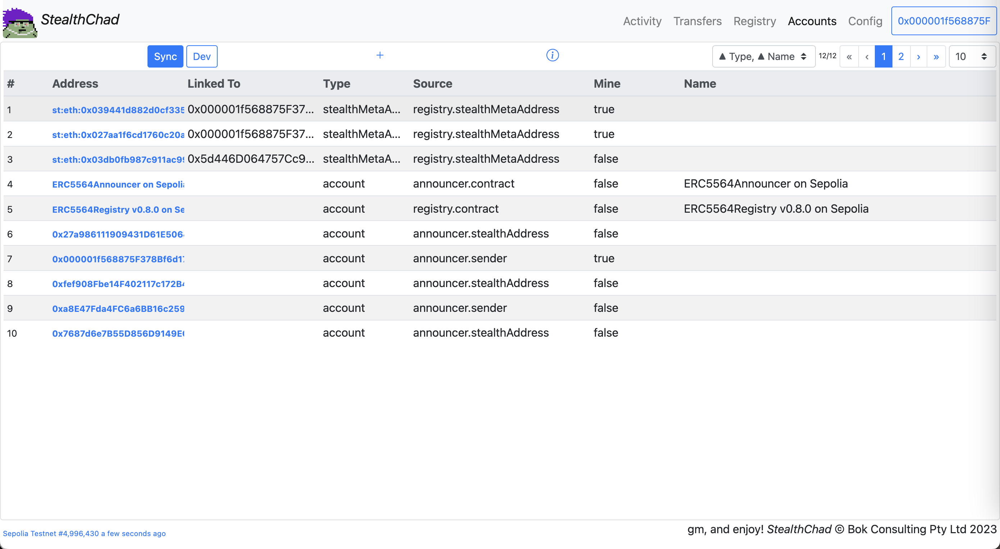
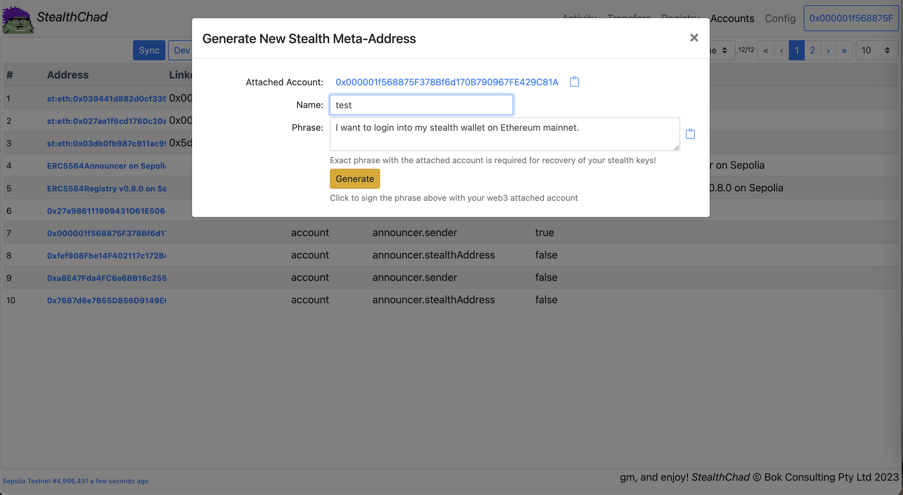
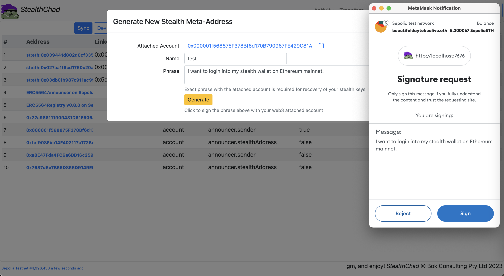
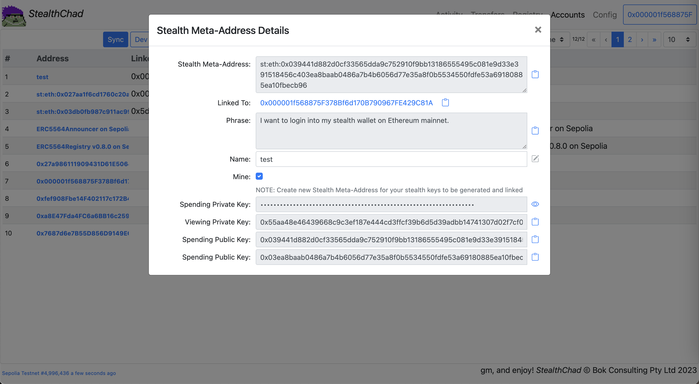
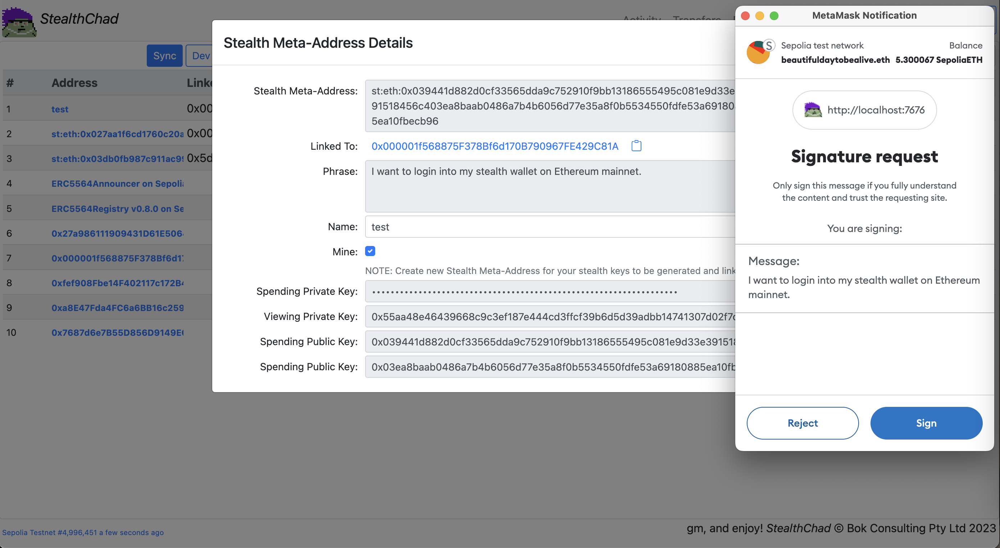
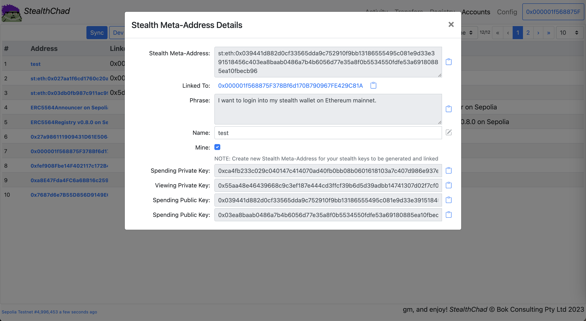
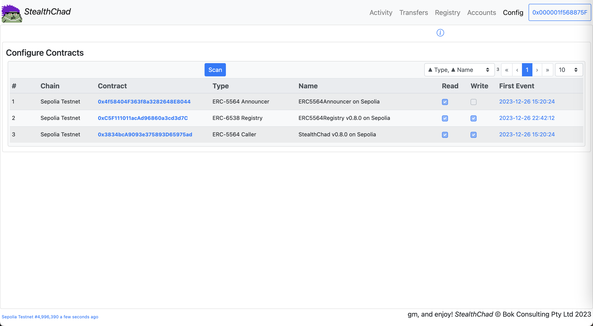
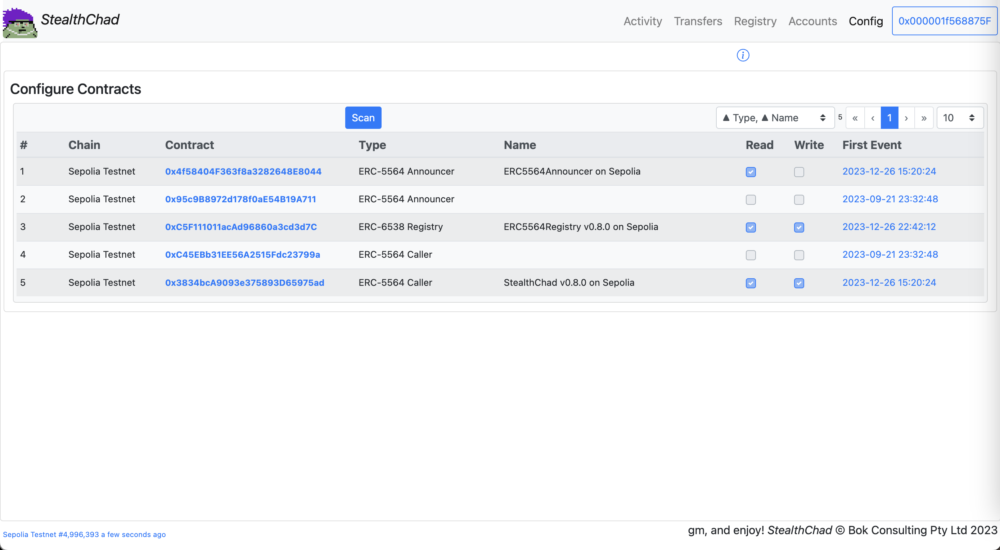
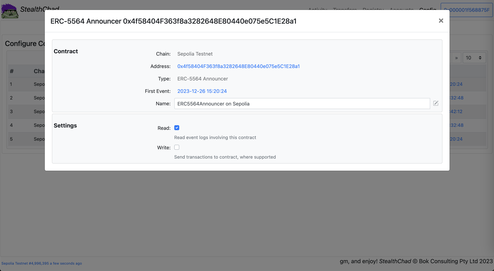
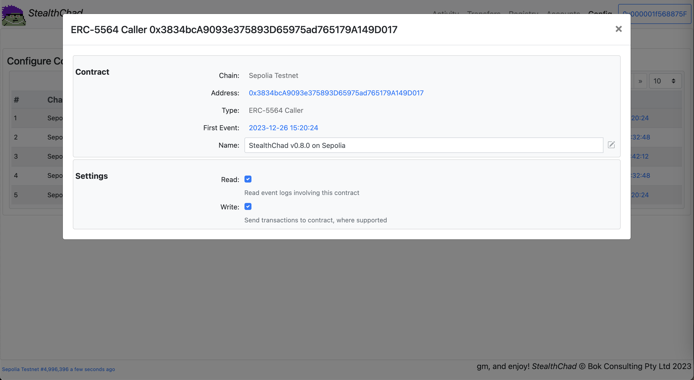

# Stealth Chad
Stealth Chad - Exploring [ERC-5564: Stealth Addresses](https://eips.ethereum.org/EIPS/eip-5564)

URL: [https://bokkypoobah.github.io/StealthChad/](https://bokkypoobah.github.io/StealthChad/) WIP

 

---

## References

* [ERC-5564: Stealth Addresses](https://eips.ethereum.org/EIPS/eip-5564)
* [ERC-6538: Stealth Meta-Address Registry](https://eips.ethereum.org/EIPS/eip-6538)
* https://github.com/nerolation/stealth-wallet
  * https://stealth-wallet.xyz/
  * https://nerolation.github.io/stealth-utils/ from https://github.com/nerolation/stealth-utils
  * [StealthTransactionHelper on Sepolia](https://sepolia.etherscan.io/address/0x054Aa0E0b4C92142a583fDfa9369FF3558F8dea4#code)
* https://github.com/kassandraoftroy/erc5564-contracts
* [An incomplete guide to stealth addresses](https://vitalik.eth.limo/general/2023/01/20/stealth.html)
* [ERC-5564 Stealth Addresses](https://ethereum-magicians.org/t/erc-5564-stealth-addresses/10614)
* [EIP-5564: Improving Privacy on Ethereum through Stealth Address Wallets](https://medium.com/@toni_w/eip-5564-improving-privacy-on-ethereum-through-stealth-address-wallets-fdf3250e81a1)
* [Ethereum stealth addresses (ERC-5564) library](https://github.com/jsign/zig-stealth-addresses)
* https://github.com/paulmillr/noble-curves

 

---

## Deployments

* [ERC5564Announcer.sol](deployed/ERC5564Announcer_Sepolia_0x4f58404f363f8a3282648e80440e075e5c1e28a1.sol) on Sepolia [0x4f58404f363f8a3282648e80440e075e5c1e28a1](https://sepolia.etherscan.io/address/0x4f58404f363f8a3282648e80440e075e5c1e28a1#code)
* [ERC5564Registry.sol](deployed/ERC5564Registry_v0.8.0_Sepolia_0xC5F111011acAd96860a3cd3d7C50Dd8f56a5684e.sol) on Sepolia [0xC5F111011acAd96860a3cd3d7C50Dd8f56a5684e](https://sepolia.etherscan.io/address/0xC5F111011acAd96860a3cd3d7C50Dd8f56a5684e#code)
* [StealthChad.sol v0.8.0](deployed/StealthChad_v0.8.0_Sepolia_0x3834bcA9093e375893D65975ad765179A149D017.sol) on Sepolia [0x3834bcA9093e375893D65975ad765179A149D017](https://sepolia.etherscan.io/address/0x3834bcA9093e375893D65975ad765179A149D017#code)

 

---

### Sample Screens

#### Accounts Sample Screens

##### Accounts - After Sync

<kbd></kbd>

##### Accounts - Generate Stealth Meta-Address

<kbd></kbd>

##### Accounts - Generate Stealth Meta-Address - Web3 Signing

<kbd></kbd>

##### Accounts - Generate Stealth Meta-Address - After Web3 Signing

<kbd></kbd>

##### Accounts - View Stealth Meta-Address

<kbd></kbd>

##### Accounts - View Stealth Meta-Address - Sign To View Spending Private Key

<kbd></kbd>

##### Accounts - View Stealth Meta-Address - With Spending Private Key

<kbd></kbd>

---

#### Config Sample Screens

##### Config - Before Scan

<kbd></kbd>

##### Config - After Scan

<kbd></kbd>

##### Config - Announcer

<kbd></kbd>

##### Config - Registry

<kbd></kbd>

##### Config - StealthChad

<kbd></kbd>

 

---

## Notes

npx hardhat
> 2.19.3

npm install --save-dev @nomicfoundation/hardhat-ethers ethers
