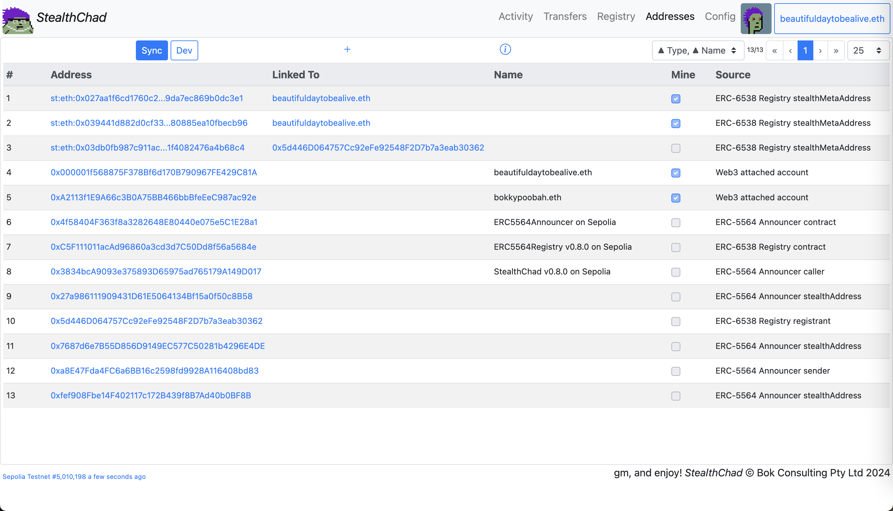
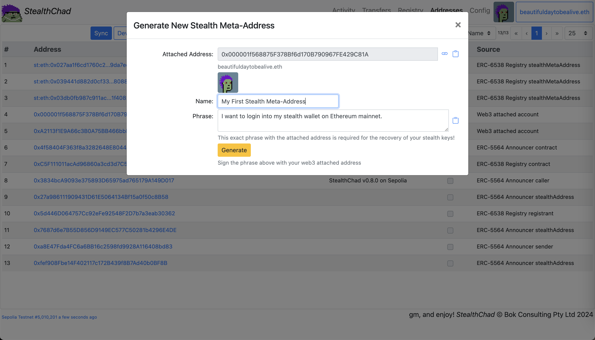
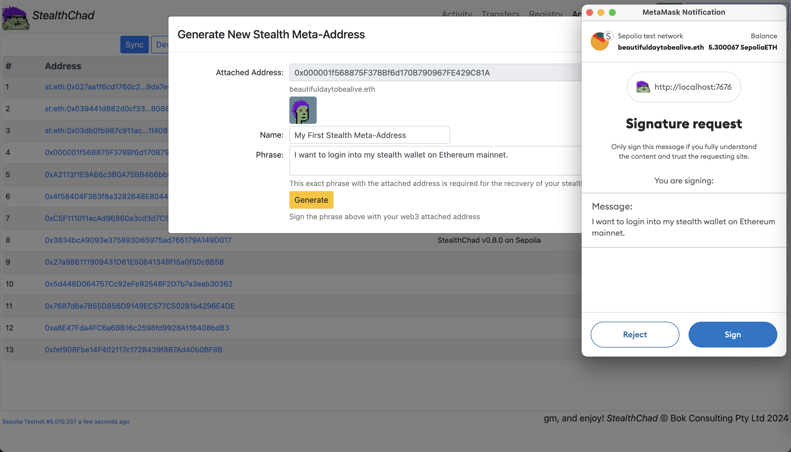
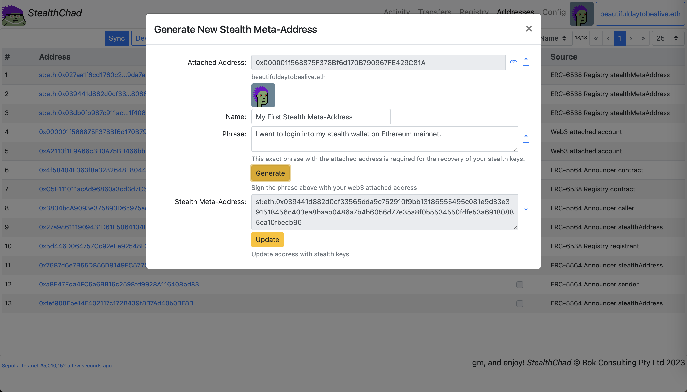
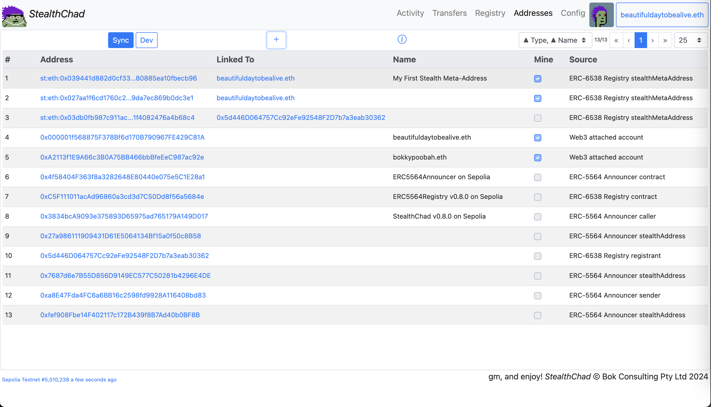
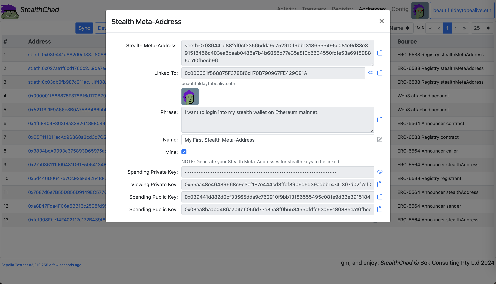
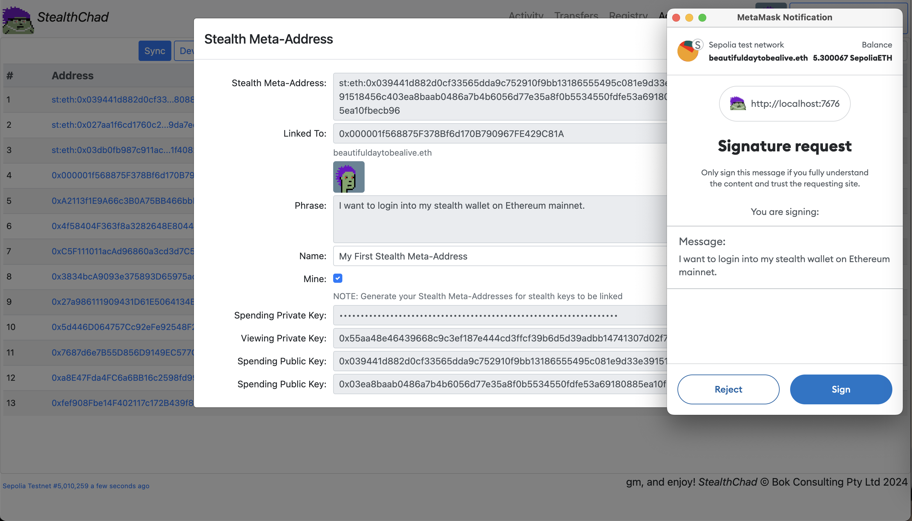
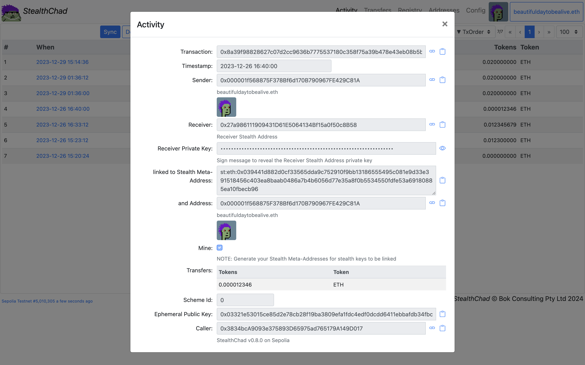
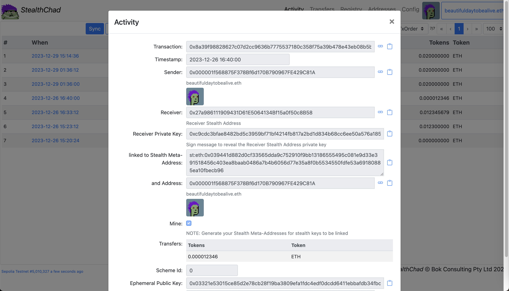
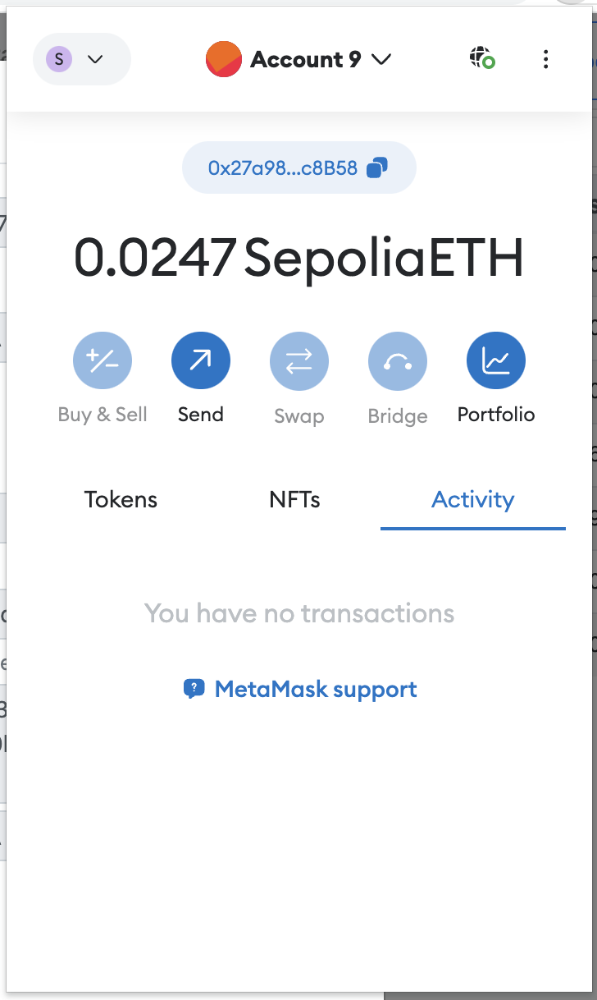

# Stealth Chad

An implementation of [ERC-5564: Stealth Addresses](https://eips.ethereum.org/EIPS/eip-5564) and [ERC-6538: Stealth Meta-Address Registry](https://eips.ethereum.org/EIPS/eip-6538) (using `bytes32` instead of `bytes`).

Test it at [https://bokkypoobah.github.io/StealthChad/](https://bokkypoobah.github.io/StealthChad/) (WIP) connected to the Ethereum Sepolia testnet.

 

### How The ERC-5564: Stealth Addresses Protocol Works

* Alice wants to pay Bob in ETH/ERC-20/ERC-721 tokens
* Bob generates a *Stealth Meta-Address* and provides this to Alice
* Alice uses Bob's *Stealth Meta-Address* to compute a random *Stealth Address* that can be accessed only by Bob
* Alice transfers the tokens to this address and announces the transfers in the *ERC-5564: Stealth Address Announcer* contract
* Bob can access the private keys to their computed *Stealth Addresses*, using information included in the announcements
* The *ERC-6538: Stealth Meta-Address Registry* allows any account to publish their associated *Stealth Meta-Addresses*

 

### How This Dapp Works

This dapp:

* Allows Bob's web3 attached account to generate a unique Stealth Meta-Address for each unique associated phrase
* Allows Alice to compute a random Stealth Address using Bob's Stealth Meta-Address
* Allows Alice to then execute the transfer to Bob's Stealth Address and announce the transfer to the Announcer
* Retrieve all event logs published to the Announcer
* Retrieves all event logs published to the Registry

 

---

### Sample Screens

#### Addresses Sample Screens

##### Addresses - After Sync

<kbd></kbd>

##### Addresses - Generate New Stealth Meta-Address

Click [+] in the Addresses screen to generate a new Stealth Meta-Address.

<kbd></kbd>

##### Addresses - Generate New Stealth Meta-Address - Sign With Web3 Wallet

<kbd></kbd>

##### Addresses - Generate New Stealth Meta-Address - After Signing

Click [Update] to update the Stealth Meta-Address keys.

<kbd></kbd>

##### Addresses - After New Generated Stealth Meta-Address Updated

<kbd></kbd>

##### Addresses - View Newly Generated Stealth Meta-Address

<kbd></kbd>

##### Addresses - View Newly Generated Stealth Meta-Address - Spending Private Key - Sign

Click on the [eye] button to sign with your web3 wallet to view the Spending Private Key.

<kbd></kbd>

##### Addresses - View Newly Generated Stealth Meta-Address - Spending Private Key

<kbd></kbd>

 

---

#### Activity Sample Screens

##### Activity - After Sync With Generated Keys

Note: Duplicated stealth payments to the same receivers for testing

<kbd></kbd>

##### Activity - Sample Stealth Payment

Item 4.

<kbd></kbd>

##### Activity - Sample Stealth Payment - Sign To View Receiver's Stealth Address Private Key

Item 4.

<kbd></kbd>

##### Activity - Sample Stealth Payment - Receiver's Stealth Address Private Key

<kbd></kbd>

##### Activity - Receiver's Stealth Address Private Key In Web3 Wallet

<kbd></kbd>

 

---

## References

* [ERC-5564: Stealth Addresses](https://eips.ethereum.org/EIPS/eip-5564)
* [ERC-6538: Stealth Meta-Address Registry](https://eips.ethereum.org/EIPS/eip-6538)
* https://github.com/nerolation/stealth-wallet
  * https://stealth-wallet.xyz/
  * https://nerolation.github.io/stealth-utils/ from https://github.com/nerolation/stealth-utils
  * [StealthTransactionHelper on Sepolia](https://sepolia.etherscan.io/address/0x054Aa0E0b4C92142a583fDfa9369FF3558F8dea4#code)
* https://github.com/kassandraoftroy/erc5564-contracts
* [An incomplete guide to stealth addresses](https://vitalik.eth.limo/general/2024/01/20/stealth.html)
* [ERC-5564 Stealth Addresses](https://ethereum-magicians.org/t/erc-5564-stealth-addresses/10614)
* [EIP-5564: Improving Privacy on Ethereum through Stealth Address Wallets](https://medium.com/@toni_w/eip-5564-improving-privacy-on-ethereum-through-stealth-address-wallets-fdf3250e81a1)
* [Ethereum stealth addresses (ERC-5564) library](https://github.com/jsign/zig-stealth-addresses)
* https://github.com/paulmillr/noble-curves

 

---

## Deployments

* [ERC5564Announcer.sol](deployed/ERC5564Announcer_Sepolia_0x4f58404f363f8a3282648e80440e075e5c1e28a1.sol) on Sepolia [0x4f58404f363f8a3282648e80440e075e5c1e28a1](https://sepolia.etherscan.io/address/0x4f58404f363f8a3282648e80440e075e5c1e28a1#code)
* [ERC5564Registry.sol v0.8.0](deployed/ERC5564Registry_v0.8.0_Sepolia_0xC5F111011acAd96860a3cd3d7C50Dd8f56a5684e.sol) on Sepolia [0xC5F111011acAd96860a3cd3d7C50Dd8f56a5684e](https://sepolia.etherscan.io/address/0xC5F111011acAd96860a3cd3d7C50Dd8f56a5684e#code)
* [StealthChad.sol v0.8.0](deployed/StealthChad_v0.8.0_Sepolia_0x3834bcA9093e375893D65975ad765179A149D017.sol) on Sepolia [0x3834bcA9093e375893D65975ad765179A149D017](https://sepolia.etherscan.io/address/0x3834bcA9093e375893D65975ad765179A149D017#code)

 

 

Enjoy!

(c) BokkyPooBah / Bok Consulting Pty Ltd 2024. The MIT Licence.
