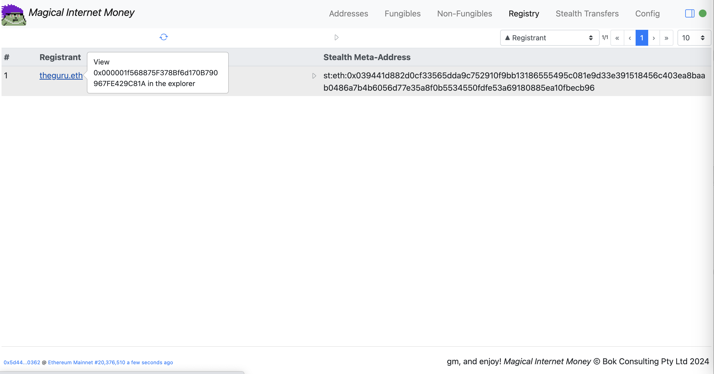

# Magical Internet Money

Status: **Work In Progress**

Magical Internet Money is here to help manage your crypto assets.

#### Features

* Multiple addresses
* EVM chain crypto assets:
  * ETH and ERC-20 Fungible Tokens
  * ERC-721 and ERC-1155 Non-Fungible Tokens
  * ENS Names (ERC-721 and ERC-1155)
  * ERC-5564 Stealth Transfer support for ETH, ERC-20 and ERC-721 tokens (testing on Sepolia Testnet). Note that the ERC-1155 tokens are not supported under the current ERC-5564 Stealth Transfers
* All data is stored in your local browser storage
* Execute simply from GitHub Pages
* No additional backend servers required
* On-chain data is used where possible, supplemented with public data sources
* Source code can be downloaded and run using e.g. [anywhere](https://www.npmjs.com/package/anywhere) in the `./docs` folder

#### Requirements
* Web3 browser, connected to Ethereum Mainnet or the Sepolia Testnet currently

#### URL
[https://bokkypoobah.github.io/MagicalInternetMoney/](https://bokkypoobah.github.io/MagicalInternetMoney/)

#### Notes
This project is currently heavily under development. Clear your browser's LocalStorage and IndexedDB if this dapp is not operating as expected as the configuration data may have a new format.

#### TODOs
* Base ERC-20/721/1155 event log scraping very slow - has a max number of blocks of ~10k
* Disable unhandled Fungibles e.g. CryptoPunks, MoonCats, CryptoCats
* Display total and individual Fungible balances

#### References

* [ERC-5564: Stealth Addresses](https://eips.ethereum.org/EIPS/eip-5564)
* [ERC-6538: Stealth Meta-Address Registry](https://eips.ethereum.org/EIPS/eip-6538)
* https://github.com/nerolation/stealth-wallet
  * https://stealth-wallet.xyz/
  * https://nerolation.github.io/stealth-utils/ from https://github.com/nerolation/stealth-utils
  * [StealthTransactionHelper on Sepolia](https://sepolia.etherscan.io/address/0x054Aa0E0b4C92142a583fDfa9369FF3558F8dea4#code)
* https://github.com/kassandraoftroy/erc5564-contracts
* [An incomplete guide to stealth addresses](https://vitalik.eth.limo/general/2024/01/20/stealth.html)
* [ERC-5564 Stealth Addresses](https://ethereum-magicians.org/t/erc-5564-stealth-addresses/10614)
* [EIP-5564: Improving Privacy on Ethereum through Stealth Address Wallets](https://medium.com/@toni_w/eip-5564-improving-privacy-on-ethereum-through-stealth-address-wallets-fdf3250e81a1)
* [Ethereum stealth addresses (ERC-5564) library](https://github.com/jsign/zig-stealth-addresses)
* https://github.com/paulmillr/noble-curves

 

---

## Deployments

We are using the contracts listed in [Stealth Address - Deployments](https://stealthaddress.dev/contracts/deployments) on the Sepolia network:

* [ERC5564Announcer @ 0x55649E01B5Df198D18D95b5cc5051630cfD45564](https://sepolia.etherscan.io/address/0x55649E01B5Df198D18D95b5cc5051630cfD45564#code)
* [ERC6538Registry @ 0x6538E6bf4B0eBd30A8Ea093027Ac2422ce5d6538](https://sepolia.etherscan.io/address/0x6538E6bf4B0eBd30A8Ea093027Ac2422ce5d6538#code)

Deployed on Sepolia:

* [MagicInternetMoney.sol v0.8.3](deployed/MagicalInternetMoney_v0.8.3_Sepolia_0xAd4EFaB0A1c32184c6254e07eb6D26A3AaEB0Ae2.sol) on Sepolia [0xAd4EFaB0A1c32184c6254e07eb6D26A3AaEB0Ae2](https://sepolia.etherscan.io/address/0xAd4EFaB0A1c32184c6254e07eb6D26A3AaEB0Ae2#code)

 

---

## Screenshots

###### Addresses

<kbd></kbd>

###### ERC-20 Fungible Tokens

<kbd></kbd>

<kbd></kbd>

###### ERC-721 and ERC-1155 Non-Fungible Tokens

<kbd></kbd>

###### ENS ERC-721 and ERC-1155 Non-Fungible Tokens With Expiries

<kbd></kbd>

###### Refresh ERC-721 and ERC-1155 Non-Fungible Tokens Metadata From The Reservoir API

<kbd></kbd>

###### View ERC-721 and ERC-1155 Non-Fungible Tokens

<kbd></kbd>

###### Add Stealth Meta-Address To Registry

<kbd></kbd>

<kbd></kbd>

<kbd></kbd>

 

---

## Old Stuff

An implementation of [ERC-5564: Stealth Addresses](https://eips.ethereum.org/EIPS/eip-5564) and [ERC-6538: Stealth Meta-Address Registry](https://eips.ethereum.org/EIPS/eip-6538) (using `address` instead of `bytes`).

Test it at [https://bokkypoobah.github.io/MagicalInternetMoney/](https://bokkypoobah.github.io/MagicalInternetMoney/) (WIP) connected to the Ethereum Sepolia testnet.

 

### How The ERC-5564: Stealth Addresses Protocol Works

* Alice wants to pay Bob in ETH/ERC-20/ERC-721 tokens
* Bob generates a *Stealth Meta-Address* and provides this to Alice
* Alice uses Bob's *Stealth Meta-Address* to compute a random *Stealth Address* that can be accessed only by Bob
* Alice transfers the tokens to this address and announces the transfers in the *ERC-5564: Stealth Address Announcer* contract
* Bob can access the private keys to their computed *Stealth Addresses*, using information included in the announcements
* The *ERC-6538: Stealth Meta-Address Registry* allows any account to publish their associated *Stealth Meta-Addresses*

 

### How This Dapp Works

This dapp:

* Allows Bob's web3 attached account to generate a unique Stealth Meta-Address for each unique associated phrase
* Allows Alice to compute a random Stealth Address using Bob's Stealth Meta-Address
* Allows Alice to then execute the transfer to Bob's Stealth Address and announce the transfer to the Announcer
* Retrieve all event logs published to the Announcer
* Retrieves all event logs published to the Registry

 

---

### Sample Screens

#### Generate And Register New Stealth Meta-Address

##### Generate New Stealth Meta-Address - Initial Addresses

Click [+] from the Addresses menu to access the Stealth Meta-Address generation screen.

<kbd></kbd>

##### Generate New Stealth Meta-Address - Generate And Sign

Click [Generate] to generate a new Stealth Meta-Address, then sign the phrase with your web3 attached account.

<kbd></kbd>

##### Generate New Stealth Meta-Address - After Generation

Click [Add] to add your newly generated Stealth Meta-Address to your addresses.

<kbd></kbd>

##### Generate New Stealth Meta-Address - Add To Registry

Click [Add/Update] to add your newly generated Stealth Meta-Address to the Stealth Address Registry, then sign and send the web3 transaction.

<kbd></kbd>

##### Generate New Stealth Meta-Address - Addresses

<kbd></kbd>

##### Generate New Stealth Meta-Address - Sync

Click [Sync] to retrieve events from the blockchains.

<kbd></kbd>

##### Generate New Stealth Meta-Address - Registry

The newly registered Stealth Meta-Address.

<kbd></kbd>

 

---

#### Stealth Transfer

##### Stealth Transfer - To Stealth Meta-Address In Registry

Click on the [>] button to send ETH/ERC-20/ERC-721 tokens to that Stealth Meta-Address.

<kbd></kbd>

##### Stealth Transfer - Specify Transfer Amount

<kbd></kbd>

##### Stealth Transfer - Send Transaction

<kbd></kbd>

##### Stealth Transfer - Sync

<kbd></kbd>

##### Stealth Transfer - New Stealth Transfer

<kbd></kbd>

##### Stealth Transfer - New Stealth Transfer Details

<kbd></kbd>

##### Stealth Transfer - Sign Message To View Private Key

<kbd></kbd>

##### Stealth Transfer - Private Key Entered In Web3 Wallet

`0.000012345 ETH` rounded to 0 in the web3 wallet.

<kbd></kbd>

 

 

Enjoy!

(c) BokkyPooBah / Bok Consulting Pty Ltd 2024. The MIT Licence.
